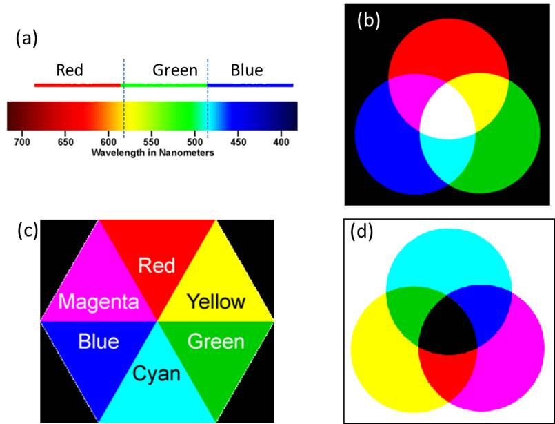
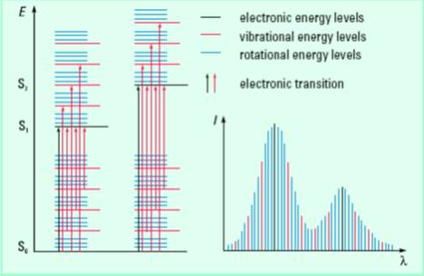

Color is an important property of many substances. We can recognize metallic gold by its shiny orange-yellow color. Interaction of light or electromagnetic radiation with matters results in scattering, absorption, reflection, diffraction, etc. of the electromagnetic radiation. These effects can give rise to the color in the substance. If some light is absorbed and the rest is transmitted through a substance, the substance is called a transparent medium with respect to the transmitted radiation. In opaque medium almost all the light is reflected. When all colors of light are present white color is produced. On the other hand, when all colors of light are absent (subtracted, filtered out or absorbed), black color is produced. One can note that the whole visible spectrum can be divided into three main regions of colors: Red, Green, and Blue (see Figure 1 below). Further it is noted that in this spectrum, where two colors combine produce another color such as yellow color by the red and green and cyan color by the green and blue combinations. Similarly, blue-red mixing produces magenta color. The colors produced by mixing two colors is said to be complementary to the color that was not used to make it. For example, out of red, green and blue colors, the combination of red and green produces yellow color (blue has not been used) and therefore complementary color of blue is yellow. A pair of colors which combines to produce white light is called complementary colors, because together they complete the spectrum. We have seen earlier that the complete visible spectrum can be mainly divided into 3 main regions of colors: Red, Green, and Blue (see Figure 1 below), each region of color contributing approximately one-third (1/3) of the spectrum. Therefore, when red and green colors of light combine to produce yellow color, two-third (1/3 from red + 1/3 from green) of the whole visible spectrum is used and only one-third (from blue region) is left. Therefore addition of this 1/3 blue region to the 2/3 of the yellow color (1/3 from red + 1/3 from green) completes the whole spectrum. Thus, blue is the complementary color of yellow and vice versa.  

  

Figure 1. a) Main three regions of visible spectrum. b) Three major colors additively combine to produce various colors (in the absence of white background) and white light. (c) Complementary colors. Opposite triangles correspond to the complementary colors. Any color in a triangle is generated by the combination of the colors on two adjacent triangles. (d) Generation of colors by various subtractive combinations of colors (in the presence of white background).  

The combination of colors producing other colors and complementary colors are given in the form of color polygon in the following figure. The complementary color of red is cyan and of green is magenta. In most of our practical applications such as painting, photography, printing, fabric dying, etc., colors are generated by the subtractive principles. In such cases, one starts with the white background or with the presence of all lights and subtracts some lights from this white light spectrum and observes the combination of other colors coming out of it. Paints, inks, filters, etc. are used to subtract some of the light. In order to understand the color generation by the subtractive mixture principle, we consider the following example. Let us put some ink on a piece of paper. The piece of paper has a white background due to the reflectance of almost all the colors of visible light. The ink will subtract (absorb) some light from this spectrum and will allow reflectance of the rest of the light. Now if we assume that the ink subtracts (absorbs) the yellow color (a combination of red and green color regions), then the red and green colors are absent from the spectrum and mainly blue region of the spectrum is reflected. Therefore the ink will appear blue in color. Similarly a yellow ink reflects red and green light and absorbs blue light. A color subtracts its complementary color. Let us see the following example of a transparent solution. In the following Figure 2, mainly green light is absorbed and its complementary color, magenta, is observed to be the color of the solution.  

Figure 2. Light absorption and color generation in a solution.

Absorption of light energy involves a transfer of energy from the radiation field to the absorber resulting in transition of the absorber from a lower to a higher energy level. Absorption of the UV-visible light may lead to excitation of electrons from one energy level to another (subject to other conditions). The study of the electronic transitions under UV-visible light excitation is known as UV-visible absorption spectroscopy. In a molecule, the energy spacing between the ground and excited electronic energy states is determined by the bonding strength between the nuclei and the electrons. Therefore, the characteristic energy of a transition and the wavelength of radiation absorbed are properties of a group of atoms. The group of atoms causing such absorption is called a chromophore. Substituents with unshared pair e's like OH, NH, SH, etc. when attached to a π chr omophore generally move the absorption maximum to longer wavelength. These substituents are called auxochromes. Substituents may have any of the following four effects on a chromophore: (i) Bathochromic shift (red shift) – a shift to longer wavelength (λ) or lower energy. (ii) Hypsochromic shift (blue shift) – shift to shorter λ or higher energy. (iii) Hyperchromic effect – an increase in absorbance (intensity) of a band. (iv) Hypochromism: decrease in absorbance (intensity) of a band. Different substances absorb different wavelengths of light. Therefore, the wavelength of maximum absorption by a substance is one of the characteristic properties of that substance.  

The most probable transition often occurs from the highest occupied molecular orbital (HOMO) to the lowest unoccupied molecular orbital (LUMO). In polyatomic molecules, it is convenient to classify the electronic transitions by specifying the initial and final orbitals. For example, if an electronic transition occurs from a bonding pi (π) orbital to antibonding pi orbital (π ∗ ), we call it a π→π ∗ transition and similarly for a transition from nonbonding orbital (n) to an antibonding pi orbital (π * ) is known as n→π ∗ transition. The following Figure 3 schematically shows some such transitions  

Figure 3. Typical electronic transitions and light absorptions.

In the cases of atoms, such transitions should result in very narrow absorbance spectral bands at wavelengths characteristic of the difference in involved energy levels of the absorbing species. However, broad spectral bands are often observed in the cases of molecules. Since electronic energy is more than the vibrational and rotational energies, vibrational and rotational energy levels are superimposed on the electronic energy levels. Therefore, any electronic transition may be associated with many vibrational and rotational transitions (subject to some conditions) with different energies giving rise to broadened bands (see the Figure 4 below). The solvent-solute interactions also broaden the spectral band.  

Figure 4. Electronic transitions in molecules and origin of UV-visible spectral band. S stands for singlet electronic energy state.  

Charge-transfer transition is another type of electronic transition that is responsible for the intense color of many transition metal complexes and inorganic pigments. In charge transfer transitions, an electron transfers from the d orbitals of the metal to one of the vacant orbitals in ligands or υice υersa. For example, an electron transfer from an O atom to the Mn atom causes the intense purple color of aqueous permanganate ion, MnO4 − .  

A typical UV-visible spectrophotometer should have the following design components: a light source (that generates light at a specific wavelength or wavelengths), a dispersion device (causes different wavelengths of light to be dispersed at different angles), sample chamber, and one or more detector(s). VU-visible spectrophotometers may have two light sources: one for the UV range (e.g. a deuterium arc lamp) and the other for the visible range (e.g., tungsten-halogen lamp).  

The dispersion device disperses source light into a "rainbow" of wavelengths (i.e., into different wavelengths of light), which are then directed to the sample. Prisms and holographic gratings are two dispersion devices commonly used in UV-visible spectrophotometers. In a conventional spectrophotometer, the entrance slit and an exit slit surrounding the dispersion device together constitute the monochromator. Light coming out of the monochromator passes through the sample blank and/or sample. The intensity of the transmitted light is measured with a photodetector. Photomultiplier tubes (PMTs) or photodiodes (photodiode array) are commonly used as detectors. The photodetector behind the sample receives the light stimulus and generates an analog electronic current, which is then converted to a usable format and fed into a computer for further analysis. In a conventional spectrophotometer, the spectrum is obtained in a sequential manner, one wavelength after another, as a function of time. In a diode array spectrophotometer, polychromatic light after passing through the sample is focused on the entrance slit of the polychromator. This transmitted light is then dispersed onto the diode array where each diode measures a portion of the spectrum. That is, in a diode array spectrophotometer, the detector sees all of the wavelengths simultaneously.  

Depending on the light beam, there are two different kinds of spectrophotometers used: single-beam and double-beam spectrophotometers. Single-beam includes both conventional and diode array spectrophotometers where a single light beam is used to illuminate first the sample blank and then the sample separately. A double beam instrument splits the light beam between the reference (sample blank) optical path and sample optical path and compares the light intensity between them. The splitting of the beam is accomplished in two ways. In a static method, a partially transmitting mirror is used that allows the light to be sent to the reference cell and sample cell simultaneously. In some spectrophotometers, a "chopper" alternates the light path. Both the spectrophotometers have a few advantages over the other. One expects a better stability of the light source, detectors and associated electronic devices with a double beam instrument. The disadvantages include the precision required in recombining the beams prior to reaching the monochrometer. The quality of the mirrors, other optics and their coatings and the dust buildup on these devices make the double beam instruments somewhat more difficult to maintain than single beam devices. In single beam instrument, only one cuvette holder is present, therefore, two measurements necessary. The sample and the sample blank (reference) are scanned simultaneously in one measurement with a double beam instrument, which has two cell holders. Diode Array spectrophotometer is a multichannel instrument, though requires two measurements, but measurements are very fast (0.1s) and have low resolution.  

Schematics of a typical double-beam UV-Visible spectrophotometer is shown below in Figure 5.  

Figure 5. Schematics of a typical Double-Beam UV-Visible Spectrophotometer.  

The absorption of light is usually experimentally measured in terms of transmittance (T) or absorbance (A). Transmittance is defined as T = I / I 0 , where I is the light intensity after it passes through the sample and Io is the initial light intensity. The relation between A and T is: $$A = -log_{10}T = - log_{10} {I \over I_{0}}$$

Modern absorption measurement instruments such as colorimeter and spectrophotometers can usually display the data as transmittance, %-transmittance, or absorbance. In a spectrophotometer, a whole series of wavelengths of light passes through a substance or its solution taken in a cell (sample cell) and through an identical container (reference cell) which only has the solvent in it. The intensity of the light entering the sample and that of the light exiting the sample are compared producing a suitable spectrum. In fact, light attenuation in an absorbance experiment occurs from many processes such as absorbance by the solvent, reflections from the interface between air and the sample, the sample and the cuvette, in addition to the chromophore. These factors are often removed by defining I 0 as the light passing through sample "blank" or reference sample ("baseline" correction). A sample blank or reference sample is the solvent and other substances, if any, excluding the chromophore substance. A variety of sample holders or sample cells are available. The choice of the sample cell is based on a number of factors, such as the pv ;ath length, shape, size, the transmission characteristics at the wavelength of interest, etc. The cell holding the sample or its blank should be transparent to the wavelength region to be recorded. A quartz or fused silica cuvette is chosen for better UV light transmission. Silicate glass cuvettes can be used for the use between 350 and 2000 nm wavelengths. The cells are generally rectangular with different pathlengths, ranging from 10 mm to 1 mm.   